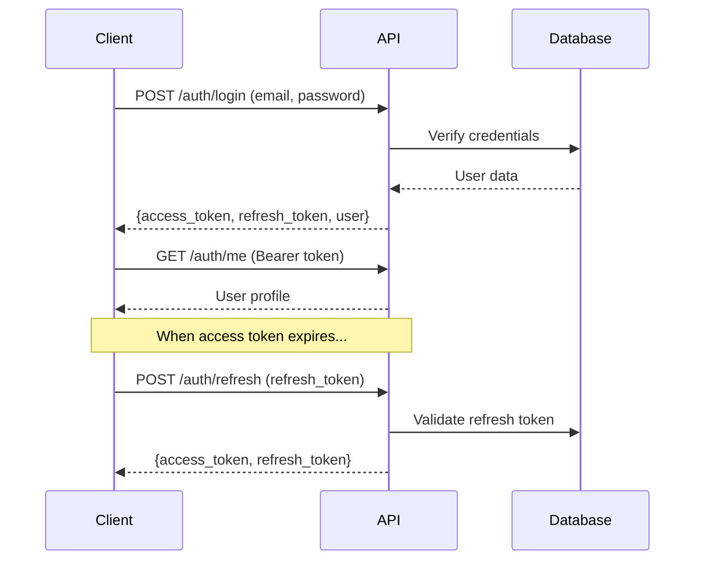

# 📖 API Reference

Complete documentation for LedgerBank API endpoints, authentication, and data models.

## 🌐 **Base URL**

```
http://localhost:4000/api
```

**Production:** `https://your-app.onrender.com/api`

## 🔐 **Authentication**

### **JWT Bearer Token**

All protected endpoints require a JWT Bearer token:

```http
Authorization: Bearer <your_access_token>
```

### **Token Types**

| Token Type | Expiry | Purpose |
|------------|--------|---------|
| **Access Token** | 15 minutes | API requests |
| **Refresh Token** | 7 days | Get new access tokens |

### **Authentication Flow**



## 📋 **Endpoints**

### **Health Check**

#### `GET /api/health`

Check service health and status.

**No authentication required.**

**Response:**
```json
{
  "status": "ok",
  "timestamp": "2024-01-15T10:30:00Z",
  "version": "1.0.0",
  "uptime": 12345
}
```

**Example:**
```bash
curl http://localhost:4000/api/health
```

#### `GET /api/health/detailed`

Detailed health check including database and system status.

**Response:**
```json
{
  "status": "ok",
  "timestamp": "2024-01-15T10:30:00Z",
  "checks": {
    "database": "ok",
    "memory": "ok",
    "disk": "ok"
  },
  "version": "1.0.0"
}
```

#### `GET /api/problems`

List all available error problem types with categories.

**No authentication required.**

**Response:**
```json
{
  "data": {
    "problems": [
      {
        "code": "insufficient_funds",
        "type": "https://api.ledgerbank.com/problems/insufficient_funds",
        "status": 422,
        "title": "Insufficient funds for this transaction",
        "category": "business_rule",
        "retryable": false
      },
      {
        "code": "invalid_email_format",
        "type": "https://api.ledgerbank.com/problems/invalid_email_format",
        "status": 400,
        "title": "Invalid email format",
        "category": "validation",
        "retryable": false
      }
    ],
    "categories": {
      "validation": 12,
      "not_found": 5,
      "authentication": 6,
      "authorization": 3,
      "conflict": 3,
      "business_rule": 8,
      "external_dependency": 4,
      "system": 3
    }
  },
  "success": true
}
```

#### `GET /api/problems/{reason}`

Get detailed information for a specific error type.

**No authentication required.**

**Example:**
```bash
curl http://localhost:4000/api/problems/insufficient_funds
```

**Response:**
```json
{
  "data": {
    "code": "insufficient_funds",
    "type": "https://api.ledgerbank.com/problems/insufficient_funds",
    "status": 422,
    "title": "Insufficient funds for this transaction",
    "category": "business_rule",
    "retryable": false,
    "retry_delay_ms": 0,
    "max_retry_attempts": 0,
    "description": "Occurs when attempting to process a payment that exceeds the available account balance",
    "examples": [
      "Payment amount: $150, Available balance: $100",
      "Transfer request: $500, Account balance: $300"
    ]
  },
  "success": true
}
```

#### `GET /api/problems/category/{category}`

List all error types in a specific category.

**No authentication required.**

**Example:**
```bash
curl http://localhost:4000/api/problems/category/business_rule
```

**Response:**
```json
{
  "data": {
    "category": "business_rule",
    "problems": [
      {
        "code": "insufficient_funds",
        "type": "https://api.ledgerbank.com/problems/insufficient_funds",
        "status": 422,
        "title": "Insufficient funds for this transaction",
        "retryable": false
      },
      {
        "code": "daily_limit_exceeded",
        "type": "https://api.ledgerbank.com/problems/daily_limit_exceeded",
        "status": 422,
        "title": "Daily transaction limit exceeded",
        "retryable": false
      }
    ]
  },
  "success": true
}
```

---

### **Authentication**

#### `POST /api/auth/login`

Authenticate user and receive JWT tokens.

**Request:**
```json
{
  "email": "user@example.com",
  "password": "password123"
}
```

**Response:**
```json
{
  "data": {
    "access_token": "eyJhbGciOiJIUzI1NiIsInR5cCI6IkpXVCJ9...",
    "refresh_token": "eyJhbGciOiJIUzI1NiIsInR5cCI6IkpXVCJ9...",
    "user": {
      "id": "123e4567-e89b-12d3-a456-426614174000",
      "email": "user@example.com",
      "full_name": "John Doe",
      "role": "user",
      "status": "ACTIVE"
    }
  },
  "success": true,
  "timestamp": "2024-01-15T10:30:00Z"
}
```

**Example:**
```bash
curl -X POST http://localhost:4000/api/auth/login \
  -H "Content-Type: application/json" \
  -d '{
    "email": "alice@example.com",
    "password": "password123"
  }'
```

#### `POST /api/auth/refresh`

Get new access token using refresh token.

**Request:**
```json
{
  "refresh_token": "eyJhbGciOiJIUzI1NiIsInR5cCI6IkpXVCJ9..."
}
```

**Response:**
```json
{
  "data": {
    "access_token": "eyJhbGciOiJIUzI1NiIsInR5cCI6IkpXVCJ9...",
    "refresh_token": "eyJhbGciOiJIUzI1NiIsInR5cCI6IkpXVCJ9..."
  },
  "success": true
}
```

#### `POST /api/auth/logout`

Revoke refresh token (logout).

**Request:**
```json
{
  "refresh_token": "eyJhbGciOiJIUzI1NiIsInR5cCI6IkpXVCJ9..."
}
```

**Response:**
```json
{
  "data": {
    "message": "Successfully logged out"
  },
  "success": true
}
```

#### `GET /api/auth/me`

Get current user profile.

**Authentication:** Required (Bearer token)

**Response:**
```json
{
  "data": {
    "id": "123e4567-e89b-12d3-a456-426614174000",
    "email": "user@example.com",
    "full_name": "John Doe",
    "role": "user",
    "status": "ACTIVE",
    "active": true,
    "verified": false,
    "inserted_at": "2024-01-15T10:30:00Z",
    "updated_at": "2024-01-15T10:30:00Z"
  },
  "success": true
}
```

---

### **User Management**

#### `GET /api/users`

List users with pagination and filtering.

**Authentication:** Required (Admin only)

**Query Parameters:**
- `page` - Page number (default: 1)
- `page_size` - Items per page (default: 20, max: 100)
- `status` - Filter by status (ACTIVE, SUSPENDED, DELETED)
- `role` - Filter by role (user, admin, support)
- `sort` - Sort by field (format: `field:direction`)

**Example:**
```bash
curl "http://localhost:4000/api/users?page=1&page_size=20&status=ACTIVE" \
  -H "Authorization: Bearer <admin_token>"
```

**Response:**
```json
{
  "data": [
    {
      "id": "123e4567-e89b-12d3-a456-426614174000",
      "email": "user@example.com",
      "full_name": "John Doe",
      "role": "user",
      "status": "ACTIVE",
      "inserted_at": "2024-01-15T10:30:00Z"
    }
  ],
  "success": true,
  "metadata": {
    "pagination": {
      "page": 1,
      "page_size": 20,
      "total_count": 100,
      "total_pages": 5,
      "has_next": true,
      "has_prev": false
    }
  }
}
```

#### `POST /api/users`

Create new user.

**Request:**
```json
{
  "email": "newuser@example.com",
  "full_name": "New User",
  "password": "password123",
  "password_confirmation": "password123"
}
```

**Response:**
```json
{
  "data": {
    "id": "123e4567-e89b-12d3-a456-426614174000",
    "email": "newuser@example.com",
    "full_name": "New User",
    "role": "user",
    "status": "ACTIVE",
    "active": true,
    "verified": false,
    "inserted_at": "2024-01-15T10:30:00Z"
  },
  "success": true
}
```

#### `GET /api/users/{id}`

Get user by ID.

**Authentication:** Required (Admin or own profile)

**Response:**
```json
{
  "data": {
    "id": "123e4567-e89b-12d3-a456-426614174000",
    "email": "user@example.com",
    "full_name": "John Doe",
    "role": "user",
    "status": "ACTIVE",
    "active": true,
    "verified": false,
    "inserted_at": "2024-01-15T10:30:00Z",
    "updated_at": "2024-01-15T10:30:00Z"
  },
  "success": true
}
```

#### `PUT /api/users/{id}`

Update user.

**Authentication:** Required (Admin or own profile)

**Request:**
```json
{
  "full_name": "Updated Name",
  "email": "updated@example.com"
}
```

#### `DELETE /api/users/{id}`

Delete user (soft delete).

**Authentication:** Required (Admin only)

**Response:**
```json
{
  "data": {
    "message": "User deleted successfully"
  },
  "success": true
}
```

---

### **Payments**

#### `GET /api/payments`

List user's payments.

**Authentication:** Required

**Query Parameters:**
- `page` - Page number (default: 1)
- `page_size` - Items per page (default: 20)
- `status` - Filter by status (PENDING, PROCESSING, COMPLETED, FAILED)
- `direction` - Filter by direction (CREDIT, DEBIT)
- `sort` - Sort by field (format: `field:direction`)

**Response:**
```json
{
  "data": [
    {
      "id": "123e4567-e89b-12d3-a456-426614174000",
      "amount": "100.50",
      "direction": "DEBIT",
      "status": "COMPLETED",
      "description": "Payment to merchant",
      "user_bank_account_id": "123e4567-e89b-12d3-a456-426614174000",
      "inserted_at": "2024-01-15T10:30:00Z"
    }
  ],
  "success": true,
  "metadata": {
    "pagination": {
      "page": 1,
      "page_size": 20,
      "total_count": 50,
      "total_pages": 3
    }
  }
}
```

#### `POST /api/payments`

Create new payment.

**Authentication:** Required

**Request:**
```json
{
  "amount": "100.50",
  "direction": "DEBIT",
  "payment_type": "PAYMENT",
  "description": "Payment to merchant",
  "user_bank_account_id": "123e4567-e89b-12d3-a456-426614174000"
}
```

**Response:**
```json
{
  "data": {
    "id": "123e4567-e89b-12d3-a456-426614174000",
    "amount": "100.50",
    "direction": "DEBIT",
    "status": "PENDING",
    "description": "Payment to merchant",
    "user_bank_account_id": "123e4567-e89b-12d3-a456-426614174000",
    "inserted_at": "2024-01-15T10:30:00Z"
  },
  "success": true
}
```

#### `GET /api/payments/{id}`

Get payment by ID.

**Authentication:** Required (Owner or Admin)

#### `PUT /api/payments/{id}`

Update payment (limited fields).

**Authentication:** Required (Owner or Admin)

#### `DELETE /api/payments/{id}`

Cancel payment.

**Authentication:** Required (Owner or Admin)

---

## 📊 **Response Format**

### **Success Response**

All successful responses follow this format:

```json
{
  "data": { ... },
  "success": true,
  "timestamp": "2024-01-15T10:30:00Z",
  "correlation_id": "req_1234567890abcdef",
  "metadata": { ... }
}
```

### **Error Response**

All error responses follow RFC 9457 Problem Details format:

```json
{
  "type": "https://api.ledgerbank.com/problems/invalid_email_format",
  "title": "Invalid email format",
  "status": 400,
  "detail": "The email address format is invalid",
  "instance": "req_1234567890abcdef",
  "code": "invalid_email_format",
  "reason": "invalid_email_format",
  "category": "validation",
  "retryable": false,
  "timestamp": "2024-01-15T10:30:00Z",
  "details": {
    "field": "email",
    "value": "invalid-email"
  }
}
```

**Content-Type:** `application/problem+json`

**Retry-After Header:** Included for retryable errors (e.g., `Retry-After: 1000`)

## 🎯 **Error Categories**

| Category | HTTP Code | Description | Retryable |
|----------|-----------|-------------|-----------|
| `validation_error` | 400 | Input validation failures | No |
| `not_found` | 404 | Resource not found | No |
| `unauthorized` | 401 | Authentication failures | No |
| `forbidden` | 403 | Authorization failures | No |
| `conflict` | 409 | Resource conflicts | No |
| `unprocessable_entity` | 422 | Business rule violations | No |
| `service_unavailable` | 503 | External service failures | Yes |
| `internal_server_error` | 500 | Internal system errors | Yes |

## 🔄 **Pagination**

List endpoints support pagination with these parameters:

- `page` - Page number (default: 1, minimum: 1)
- `page_size` - Items per page (default: 20, maximum: 100)

**Example:**
```bash
GET /api/users?page=2&page_size=50
```

**Response includes pagination metadata:**
```json
{
  "metadata": {
    "pagination": {
      "page": 2,
      "page_size": 50,
      "total_count": 100,
      "total_pages": 2,
      "has_next": false,
      "has_prev": true
    }
  }
}
```

## 🔍 **Filtering & Sorting**

### **Filtering**

Filter by specific fields:
- `status` - User status (ACTIVE, SUSPENDED, DELETED)
- `role` - User role (user, admin, support)
- `direction` - Payment direction (CREDIT, DEBIT)

**Example:**
```bash
GET /api/users?status=ACTIVE&role=admin
```

### **Sorting**

Sort by fields with direction:
- Format: `field:direction`
- Directions: `asc`, `desc`
- Multiple sorts: comma-separated

**Example:**
```bash
GET /api/users?sort=email:asc,name:desc
```

## 📝 **Data Models**

### **User**

```json
{
  "id": "123e4567-e89b-12d3-a456-426614174000",
  "email": "user@example.com",
  "full_name": "John Doe",
  "role": "user",
  "status": "ACTIVE",
  "active": true,
  "verified": false,
  "inserted_at": "2024-01-15T10:30:00Z",
  "updated_at": "2024-01-15T10:30:00Z"
}
```

### **Payment**

```json
{
  "id": "123e4567-e89b-12d3-a456-426614174000",
  "amount": "100.50",
  "direction": "DEBIT",
  "payment_type": "PAYMENT",
  "status": "COMPLETED",
  "description": "Payment to merchant",
  "user_bank_account_id": "123e4567-e89b-12d3-a456-426614174000",
  "inserted_at": "2024-01-15T10:30:00Z",
  "updated_at": "2024-01-15T10:30:00Z"
}
```

### **Bank Account**

```json
{
  "id": "123e4567-e89b-12d3-a456-426614174000",
  "account_name": "My Checking Account",
  "account_type": "CHECKING",
  "balance": "1500.00",
  "currency": "USD",
  "bank_id": "123e4567-e89b-12d3-a456-426614174000",
  "user_id": "123e4567-e89b-12d3-a456-426614174000",
  "inserted_at": "2024-01-15T10:30:00Z"
}
```

## 🧪 **Testing the API**

### **Using Swagger UI**

1. Open **http://localhost:4000/api/docs**
2. Click "Authorize" and enter your JWT token
3. Use "Try it out" buttons to test endpoints
4. View request/response schemas

### **Using curl**

```bash
# Login and get token
TOKEN=$(curl -s -X POST http://localhost:4000/api/auth/login \
  -H "Content-Type: application/json" \
  -d '{"email":"alice@example.com","password":"password123"}' \
  | jq -r '.data.access_token')

# Use token for authenticated requests
curl -H "Authorization: Bearer $TOKEN" \
  http://localhost:4000/api/auth/me
```

### **Using Postman**

1. Import the OpenAPI spec from `/api/swagger.json`
2. Set up environment variables for base URL and tokens
3. Use the collection to test all endpoints

## 🔧 **Rate Limiting**

- **100 requests per minute** per IP address
- Returns `429 Too Many Requests` when exceeded
- Includes `Retry-After` header with seconds to wait

## 🛡️ **Security**

### **Authentication**

- JWT tokens with 15-minute expiry
- Refresh tokens with 7-day expiry
- Token rotation on refresh
- Database revocation support

### **Authorization**

- Role-based access control (RBAC)
- Policy-based permission checks
- Resource ownership validation

### **Input Validation**

- Multi-layer validation (Web → Service → Schema)
- Null byte rejection
- Length limits on all fields
- SQL injection prevention

---

**Need more details?** Check out the [Architecture Guide](ARCHITECTURE.md) for system design information.
