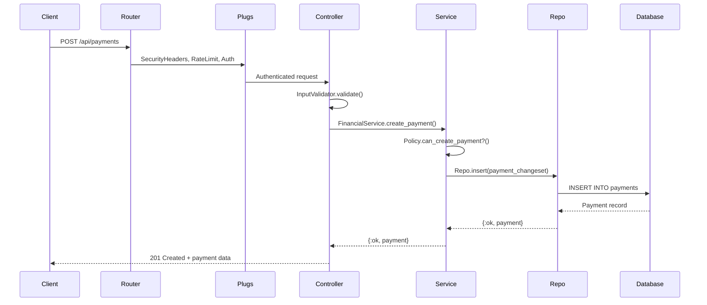
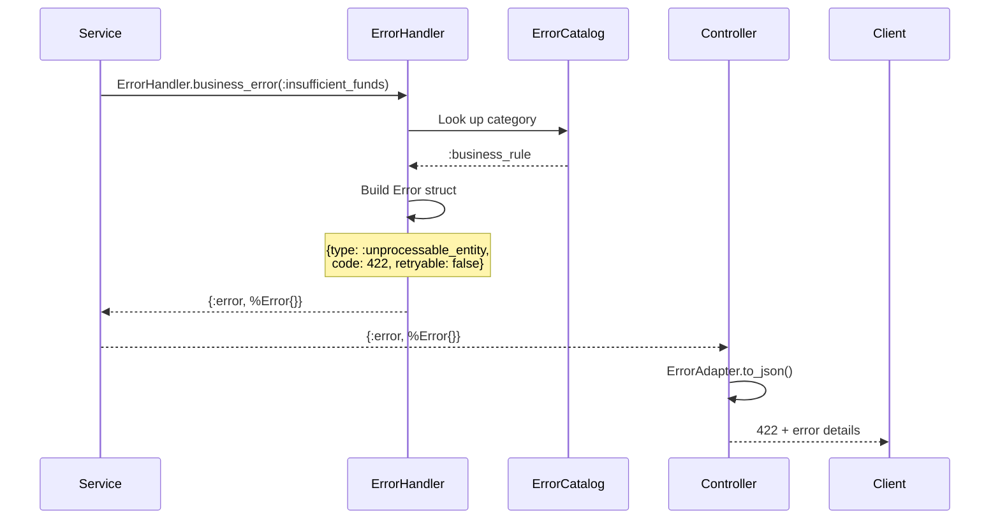
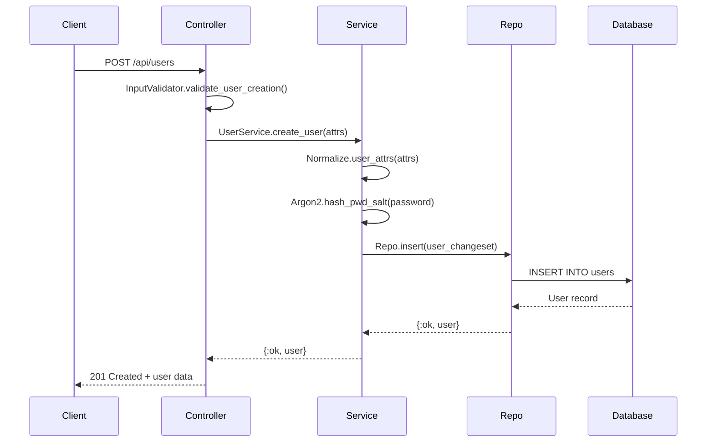
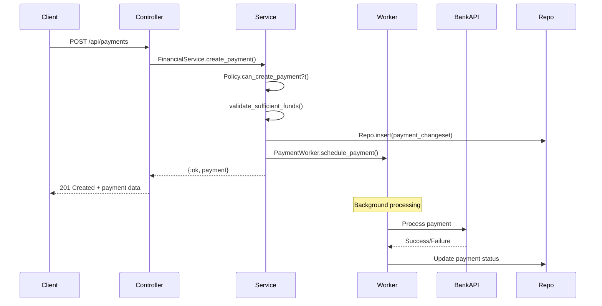

# 🏗️ Architecture Guide

Deep dive into the system design, patterns, and architectural decisions behind LedgerBank API.

## 🎯 **Architecture Overview**

LedgerBank API follows **Clean Architecture** principles with clear layer separation:

```
┌─────────────────────────────────────────────────────────────┐
│                    HTTP Layer (Web)                         │
│  ┌─────────────┐ ┌─────────────┐ ┌─────────────────────┐   │
│  │   Router    │ │   Plugs     │ │   Controllers       │   │
│  │             │ │ • Security  │ │ • InputValidator    │   │
│  │             │ │ • RateLimit │ │ • ErrorAdapter      │   │
│  │             │ │ • Auth      │ │                     │   │
│  └─────────────┘ └─────────────┘ └─────────────────────┘   │
└─────────────────────────────────────────────────────────────┘
                                │
                                ▼
┌─────────────────────────────────────────────────────────────┐
│                 Business Layer (Services)                   │
│  ┌─────────────┐ ┌─────────────┐ ┌─────────────────────┐   │
│  │   Services  │ │  Policies   │ │    Normalize        │   │
│  │ • UserSvc   │ │ • Auth      │ │ • Data transform    │   │
│  │ • Financial │ │ • Financial │ │ • Security          │   │
│  └─────────────┘ └─────────────┘ └─────────────────────┘   │
└─────────────────────────────────────────────────────────────┘
                                │
                                ▼
┌─────────────────────────────────────────────────────────────┐
│                   Data Layer (Repository)                   │
│  ┌─────────────┐ ┌─────────────┐ ┌─────────────────────┐   │
│  │   Schemas   │ │    Repo     │ │     Workers         │   │
│  │ • Ecto      │ │ • Queries   │ │ • Oban              │   │
│  │ • Changeset │ │ • Cache     │ │ • Background jobs   │   │
│  └─────────────┘ └─────────────┘ └─────────────────────┘   │
└─────────────────────────────────────────────────────────────┘
                                │
                                ▼
┌─────────────────────────────────────────────────────────────┐
│                    Infrastructure                           │
│  ┌─────────────┐ ┌─────────────┐ ┌─────────────────────┐   │
│  │ PostgreSQL  │ │     ETS     │ │   External APIs     │   │
│  │ • Primary   │ │ • Cache     │ │ • Monzo             │   │
│  │ • Migrations│ │ • Sessions  │ │ • Bank APIs         │   │
│  └─────────────┘ └─────────────┘ └─────────────────────┘   │
└─────────────────────────────────────────────────────────────┘
```

## 🏛️ **Core Architectural Patterns**

### **1. Clean Architecture**

**Principle:** Dependencies point inward. Outer layers depend on inner layers, never the reverse.

**Implementation:**
- **Web Layer** → **Business Layer** → **Data Layer**
- Controllers call Services, Services call Repo
- No business logic in controllers
- No database queries in controllers

**Benefits:**
- Testable (mock inner layers)
- Flexible (swap implementations)
- Maintainable (clear boundaries)

### **2. Behavior-Driven Design**

**Pattern:** Use Elixir behaviors to define contracts and eliminate boilerplate.

**Implemented Behaviors:**

#### **WorkerBehavior**
```elixir
# Before: 180+ lines of boilerplate per worker
def perform(%Oban.Job{} = job) do
  start_time = System.monotonic_time(:millisecond)
  correlation_id = Error.generate_correlation_id()
  # ... 150+ lines of infrastructure code
end

# After: 40 lines of pure business logic
use LedgerBankApi.Core.WorkerBehavior, queue: :payments

def perform_work(%{"payment_id" => id}, context) do
  # Just business logic - infrastructure handled automatically
end
```

#### **ServiceBehavior**
```elixir
# Standardized service operations with error handling
def get_user(id) do
  context = ServiceBehavior.build_context(__MODULE__, :get_user, %{user_id: id})
  ServiceBehavior.get_operation(User, id, :user_not_found, context)
end
```

#### **CacheAdapter**
```elixir
# Pluggable cache backends
config :ledger_bank_api, :cache_adapter, 
  LedgerBankApi.Core.Cache.EtsAdapter  # Single node

# Future: Switch to Redis with one config change
config :ledger_bank_api, :cache_adapter,
  LedgerBankApi.Core.Cache.RedisAdapter  # Multi-node
```

### **3. Error Catalog System**

**Problem:** Most APIs have inconsistent error handling.

**Solution:** Centralized error taxonomy that drives everything.

```elixir
# ErrorCatalog defines the mapping
def reason_codes do
  %{
    :insufficient_funds => :business_rule,    # → 422, no retry
    :bank_api_error => :external_dependency,  # → 503, retry 3x
    :invalid_email => :validation             # → 400, no retry
  }
end

# Services just reference the reason
{:error, ErrorHandler.business_error(:insufficient_funds, context)}

# System automatically:
# - Maps to HTTP 422
# - Sets retryable: false
# - Adds correlation ID
# - Emits telemetry
# - Workers know not to retry
```

**Benefits:**
- Single source of truth for all errors
- Consistent HTTP codes across the API
- Automatic retry logic based on error category
- Easy to add new error types
- Centralized error message management

### **4. Policy Pattern**

**Principle:** Authorization logic as pure functions.

```elixir
# Pure functions - no database, no side effects
def can_update_user?(%User{role: "admin"}, _target_user), do: true
def can_update_user?(%User{id: user_id}, %User{id: user_id}), do: true
def can_update_user?(_user, _target_user), do: false

# Easy to test
test "admin can update any user" do
  admin = %User{role: "admin"}
  user = %User{id: "123"}
  assert Policy.can_update_user?(admin, user)
end
```

**Benefits:**
- Testable (no mocks needed)
- Composable (combine multiple policies)
- Fast (no database queries)
- Clear (explicit permission logic)

## 🔄 **Request Flow**

### **Typical API Request**



### **Error Flow**



## 🧩 **Key Components**

### **Error Handling System**

**Architecture:**
```
Service Layer
    ↓
ErrorHandler.business_error(:reason, context)
    ↓
ErrorCatalog.reason_codes() → category
    ↓
Error struct: {type, code, retryable, correlation_id}
    ↓
Controller: ErrorAdapter.to_problem_details()
    ↓
HTTP Response: RFC 9457 Problem Details
    ↓
Content-Type: application/problem+json
    ↓
Retry-After header (for retryable errors)
```

**RFC 9457 Compliance:**
- `type` - URI identifying the problem type
- `title` - Human-readable summary
- `status` - HTTP status code
- `detail` - Human-readable explanation
- `instance` - URI identifying the specific occurrence
- Custom extensions: `code`, `reason`, `category`, `retryable`, `timestamp`

**Error Categories:**
- `:validation` → 400 (Bad Request) - No retry
- `:business_rule` → 422 (Unprocessable Entity) - No retry
- `:external_dependency` → 503 (Service Unavailable) - Retry 3x
- `:system` → 500 (Internal Server Error) - Retry 2x

### **Problem Type Registry**

**Architecture:**
```
GET /api/problems
    ↓
ProblemsController.index()
    ↓
ErrorCatalog.reason_codes() → All problems
    ↓
Group by category and return with metadata
    ↓
HTTP Response: Problem registry with descriptions
```

**Features:**
- Lists all available error types
- Groups errors by category
- Provides descriptions and examples
- Shows retry policies and HTTP status codes
- Enables client-side error handling

### **Background Job System**

**Architecture:**
```
Controller
    ↓
Service.create_payment() → {:ok, payment}
    ↓
PaymentWorker.schedule_payment(payment.id)
    ↓
Oban Queue (PostgreSQL)
    ↓
WorkerBehavior.perform_work(args, context)
    ↓
Business Logic + Error Handling
    ↓
Telemetry Events
```

**Retry Logic:**
- External API failures → Retry 3x with exponential backoff
- Business rule violations → Dead letter queue (no retry)
- System errors → Retry 2x with linear backoff

### **Caching Strategy**

**Current (Single Node):**
```
Service.get_user(id)
    ↓
Cache.get("user:#{id}")
    ↓
ETS Table (in-memory)
    ↓
Cache miss → Repo.get(User, id) → Cache.put()
```

**Future (Multi-Node):**
```
Service.get_user(id)
    ↓
Cache.get("user:#{id}")
    ↓
Redis (distributed)
    ↓
Cache miss → Repo.get(User, id) → Cache.put()
```

**Zero Code Changes:** Just update config to switch adapters.

### **Security Architecture**

**Multi-Layer Security:**

1. **Transport Security**
   - HTTPS enforcement
   - Security headers (HSTS, CSP, etc.)
   - Rate limiting (100 req/min per IP)

2. **Authentication**
   - JWT tokens with 15-minute expiry
   - Refresh tokens with 7-day expiry
   - Token rotation (old refresh token revoked)
   - Constant-time authentication (prevents timing attacks)

3. **Authorization**
   - Role-based access control (RBAC)
   - Policy functions for permission checks
   - Resource ownership validation

4. **Input Validation**
   - Multi-layer validation (Web → Service → Schema)
   - Null byte rejection
   - Length limits on all fields
   - SQL injection prevention (parameterized queries)

## 📊 **Data Flow Patterns**

### **User Registration Flow**



### **Payment Processing Flow**



## 🔧 **Configuration Architecture**

### **Environment-Based Configuration**

> **📝 Example Configuration Structure**
> 
> The following shows the configuration pattern used in this project:

```elixir
# config/config.exs - Base configuration
config :ledger_bank_api, :jwt,
  algorithm: "HS256",
  issuer: "ledger_bank_api",
  access_token_expiry: 3600

# config/dev.exs - Development overrides
config :ledger_bank_api, :jwt_secret, 
  System.get_env("JWT_SECRET", "dev-secret-please-change")

# config/prod.exs - Production overrides
config :ledger_bank_api, :jwt_secret, 
  System.get_env("JWT_SECRET") || raise "JWT_SECRET required"
```

### **Runtime Configuration**

> **📝 Example Runtime Configuration**
> 
> This demonstrates how environment variables drive configuration:

```elixir
# config/runtime.exs - Environment-driven settings
queues = System.get_env("OBAN_QUEUES", "banking:3,payments:2")
  |> String.split(",")
  |> Enum.map(fn defn ->
    [name, limit] = String.split(defn, ":")
    {String.to_atom(name), String.to_integer(limit)}
  end)

config :ledger_bank_api, Oban, queues: queues
```

## 🚀 **Scaling Architecture**

### **Current State (Single Node)**

```
┌─────────────────────────────────────────┐
│              Single Node                │
│  ┌─────────┐ ┌─────────┐ ┌───────────┐ │
│  │ Phoenix │ │   ETS   │ │PostgreSQL │ │
│  │   App   │ │  Cache  │ │  Primary  │ │
│  └─────────┘ └─────────┘ └───────────┘ │
└─────────────────────────────────────────┘
```

### **Future State (Multi-Node)**

```
┌─────────────┐ ┌─────────────┐ ┌─────────────┐
│   Node 1    │ │   Node 2    │ │   Node 3    │
│ ┌─────────┐ │ │ ┌─────────┐ │ │ ┌─────────┐ │
│ │ Phoenix │ │ │ │ Phoenix │ │ │ │ Phoenix │ │
│ │   App   │ │ │ │   App   │ │ │ │   App   │ │
│ └─────────┘ │ │ └─────────┘ │ │ └─────────┘ │
└─────────────┘ └─────────────┘ └─────────────┘
       │               │               │
       └───────────────┼───────────────┘
                       │
        ┌──────────────┴──────────────┐
        │         Redis Cache         │
        │    (Distributed Cache)      │
        └─────────────────────────────┘
                       │
        ┌──────────────┴──────────────┐
        │      PostgreSQL Cluster     │
        │  Primary + Read Replicas    │
        └─────────────────────────────┘
```

### **Scaling Strategy**

1. **Cache Layer** - Switch ETS → Redis (one config change)
2. **Database** - Add read replicas for queries
3. **Background Jobs** - Oban already supports multi-node
4. **Load Balancing** - Add nginx/HAProxy in front
5. **Monitoring** - Add APM (AppSignal/DataDog)

## 🧪 **Testing Architecture**

### **Test Pyramid**

```
        ┌─────────────────┐
        │   E2E Tests     │  ← 10% (Integration flows)
        │   (3,796 lines) │
        └─────────────────┘
       ┌─────────────────────┐
       │  Integration Tests  │  ← 30% (Service + Repo)
       │  (Service layer)    │
       └─────────────────────┘
      ┌─────────────────────────┐
      │     Unit Tests          │  ← 60% (Functions, Policies)
      │  (Pure functions)       │
      └─────────────────────────┘
```

### **Testing Strategy**

1. **Unit Tests** - Pure functions (policies, normalize, validators)
2. **Integration Tests** - Service layer with real database
3. **Controller Tests** - HTTP request/response cycles
4. **Security Tests** - Timing attacks, injection, edge cases
5. **Performance Tests** - N+1 queries, concurrent updates

## 📈 **Performance Considerations**

### **Database Optimization**

- **Indexes** on frequently queried fields
- **Keyset pagination** instead of OFFSET
- **Connection pooling** (10 connections per node)
- **Query optimization** with `explain analyze`

### **Caching Strategy**

- **User data** - 5-minute TTL
- **Account balances** - 1-minute TTL
- **Bank data** - 30-minute TTL
- **Cache warming** on application startup

### **Background Jobs**

- **Priority queues** - Critical payments first
- **Concurrency limits** - Respect external API rate limits
- **Dead letter queue** - Track failed jobs
- **Telemetry** - Monitor job performance

## 🔮 **Future Architecture**

### **Event Sourcing**

```elixir
# Future: Command/Query separation
defmodule PaymentCommands do
  def execute(%CreatePayment{} = command) do
    # Validate command
    # Emit PaymentCreated event
  end
end

defmodule PaymentProjections do
  def handle(%PaymentCreated{} = event) do
    # Update read models
  end
end
```

### **Microservices**

```
┌─────────────┐ ┌─────────────┐ ┌─────────────┐
│ User Service│ │Payment Svc  │ │Bank Service │
│ • Auth      │ │• Processing │ │• Integration│
│ • Profiles  │ │• History    │ │• Sync       │
└─────────────┘ └─────────────┘ └─────────────┘
       │               │               │
       └───────────────┼───────────────┘
                       │
            ┌──────────┴──────────┐
            │   Message Queue     │
            │   (RabbitMQ/Kafka)  │
            └─────────────────────┘
```

### **GraphQL API**

```elixir
# Future: GraphQL with Absinthe
defmodule LedgerBankApiWeb.Schema do
  use Absinthe.Schema
  
  query do
    field :user, :user do
      arg :id, non_null(:id)
      resolve &UserResolver.find/2
    end
  end
end
```

---

**This architecture demonstrates production-ready patterns while remaining simple enough to understand and extend.**
